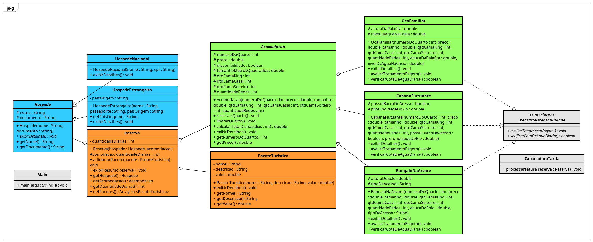

# 🏡 Pousada Selva – Gestão de Reservas de Ecoturismo

Sistema desenvolvido em Java orientada a objetos para a gestão de acomodações, hóspedes nacionais e estrangeiros, pacotes de passeios e cálculo de tarifas turísticas, contextualizado na região amazônica de Manaus e do Rio Negro.

## 👥 Equipe
* **Bryan Richard Rocha do Nascimento**
* **Ivson Padilha Freire**

---

## 🚀 Sobre o Projeto (AV3 - CETAM)
Projeto prático desenvolvido para a disciplina de Linguagem de Programação III (Java), aplicando os pilares da Programação Orientada a Objetos (POO) em um cenário real de ecoturismo regional.

### ✨ Requisitos Técnicos Implementados
* **Encapsulamento:** Atributos privados e protegidos com métodos de acesso (`getters`/`setters`).
* **Herança:** Hierarquia nas classes de `Acomodacao` (Bangalô, Cabana Flutuante e Oca Familiar) e `Hospede` (Nacional e Estrangeiro).
* **Polimorfismo:** Sobrescrita de métodos de exibição de detalhes e cálculo de tarifas em tempo de execução.
* **Interfaces:** Contrato de sustentabilidade aplicado às acomodações (`RegrasSustentabilidade`).
* **Composição:** A classe `Reserva` agrega instâncias de `Hospede`, `Acomodacao` e uma lista de `PacoteTuristico`.
* **Coleções da API Java:** Uso extensivo de `ArrayList` para gerenciar dados em memória.
* **Tratamento de Exceções:** Blocos `try-catch` robustos para blindar o menu contra entradas inválidas.
* **CRUD Completo via Console:** Menu interativo estruturado em pacotes (`model`, `service`, `main`).

---

## 📊 Arquitetura do Sistema (Diagrama de Classes)
O diagrama abaixo ilustra a modelagem orientada a objetos do sistema, dividida por pacotes funcionais:



---

## ⚙️ Pré-requisitos e Instruções de Execução

Para rodar este projeto em sua máquina, você precisará ter instalado:
* **Java JDK** (Versão 11 ou superior recomendada)
* Uma IDE de sua preferência (VS Code, IntelliJ ou Eclipse) ou terminal com suporte ao compilador Java (`javac`).

### 📥 Passos para Executar:

1. Clone o repositório em sua máquina:
   ```bash
   git clone [https://github.com/seu-usuario/jungle-lodge-system.git](https://github.com/seu-usuario/jungle-lodge-system.git)